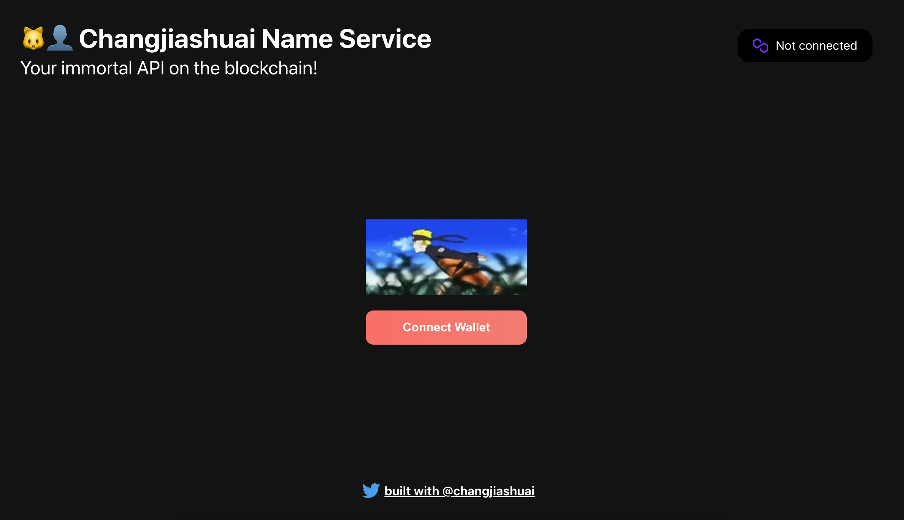
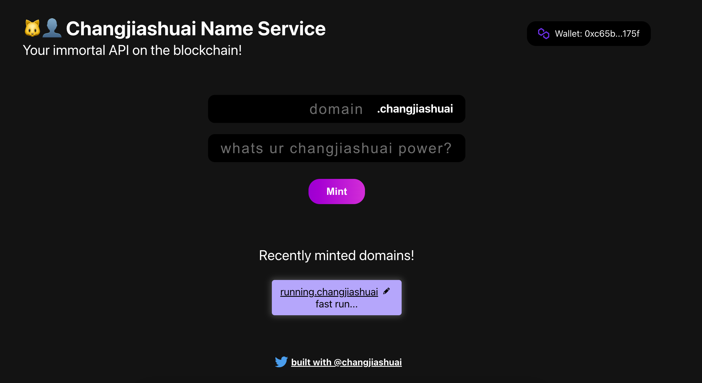

# ENS Project UI

Build your own domain service on a Polygon L2.

### **Welcome 👋**
To get started with this project, clone this repo and follow these commands:

1. Run `npm install` at the root of your directory
2. Run `yarn dev` to start the project


### Project url
```
https://domain-service.jiashuaichang.repl.co/
```

### Contract
[Contract](https://github.com/changjiashuai/ens-polygon)

### Screenshot



